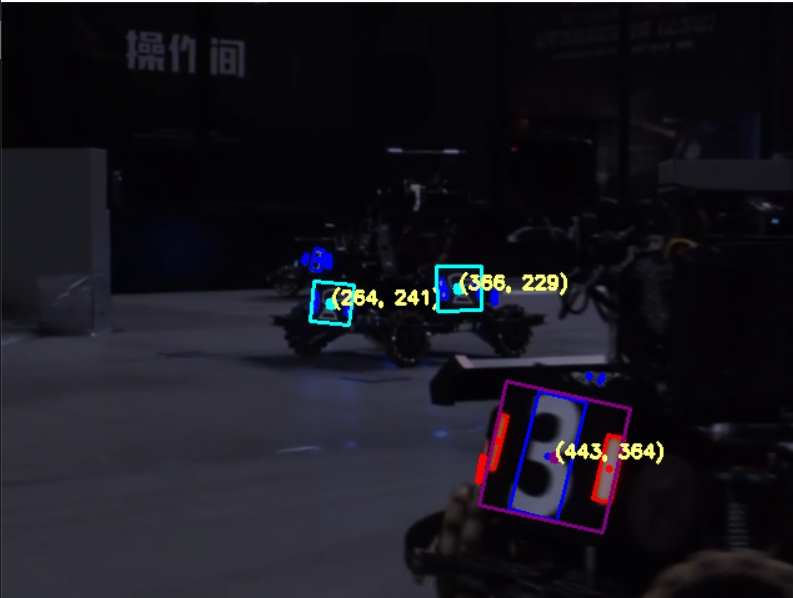

# RM_OPENCV
  - 传统视觉
  - [关于 OpenCV](https://kdocs.cn/l/cesjy4EquE2h)
---

## 运行代码的准备工作

  ### 1. 克隆代码库
    使用 Git 克隆代码仓库：
    ```bash
    git clone https://github.com/Rihoko520/rm_opencv_bgr.git
    ```

  ### 2. 环境设置
    - **Python**: 3.x。

  ### 3. 安装依赖库
    ```bash
    pip install opencv-python numpy 
    ```

---

## 功能模块介绍

### 1. [adjust.py](src/adjust.py) 功能介绍
 - `adjust.py` 通过调整 **阈值** 来实现图像的 **二值化** 处理，用于动态调整处理图像的 **二值化阈值**。

#### 使用说明
  - 修改 `val` 变量以选择处理 **阈值**。
  - 运行脚本后，通过滑动条调整阈值，以查看不同处理效果的实时结果。

---

### 2. [cam.py](src/cam.py) 功能介绍
 - `cam.py` 负责处理相机输入，支持实时目标检测和静态图像处理。它结合了 `adjust.py` 的参数调整功能，允许用户根据需要进行实时调节。

#### 使用说明
  - 设置 `mode` 变量以选择不同的处理模式：
    - **0**: 视频流调试
    - **1**: 仅运行检测
    - **2**: 仅运行检测-无图
    - **3**: 静态图调试
  - 在模式为 **0** ， **1** ，**2** 时，若 `video=True`，程序会使用指定的 URL 进行视频流处理；若 `video=False`，则使用可用的摄像头。
  - `image_path` 变量用于指定静态图像的路径。
  - `val` 变量用于设置静态值，可根据需要进行调整。

---

### 3. [detector.py](src/detector.py) 功能介绍
 - `detector.py` 提供主要的目标检测功能，负责装甲板的识别和处理。

#### 相关阈值说明

##### 二值化阈值
  - **val**: 
    - **说明**: 用于二值化处理的阈值。图像的灰度值大于此阈值的像素将被标记为白色（255），小于此值的像素将被标记为黑色（0）。调整此值可以影响二值化效果，选择合适的值可以更好地识别灯条。
    - **取值范围**: [0, 255]
    - **默认值**: 35
  
##### 灯条相关阈值
  - **light_angle_tol**:
    - **说明**: 灯条之间的角度容忍度。用于判断两个灯条是否可以被视为同一组装甲。较小的值会使得只有几乎平行的灯条被视为相同组，较大的值则会允许更大角度差异。
    - **取值范围**: [0, 180]
    - **默认值**: 5
    
  - **line_angle_tol**:
    - **说明**: 判断两灯条各自中心点的连线与两灯条是否都垂直的角度容忍度(判断两灯条是否平行的角度容忍度)。用于进一步判断两个灯条的角度是否足够接近平行，以便被视为同一组灯条。此值越大，能够容忍的角度差异越大。
    - **取值范围**: [0, 180]
    - **默认值**: 7
    
  - **height_tol**:
    - **说明**: 用于判断两个灯条的高度差容忍度。此值限制了两灯条高度的最大差异。
    - **默认值**: 10
  - **width_tol**:
    - **说明**: 用于判断两个灯条的宽度差容忍度。与高度差类似，此值限制了两灯条宽度的最大差异。
    - **默认值**: 10
  - **cy_tol**:
    - **说明**: 中心点垂直坐标差容忍度，用于判断两个灯条的中心点在垂直方向上(高度)的接近程度。该值越小，要求越严格。**这个阈值被适用于处理远距离的灯条，因为远距离的灯条轮廓太小，角度差异会有点大，这个阈值用于角度差异较大的时候做的判断**
    - **默认值**: 5
    
  - **contourArea > 5 and -30 <= angel <= 30**
    - **说明**: 过滤小的灯条和大于-30°-30°的旋转矩形。    

##### 装甲板相关阈值
  - 装甲板在图像上的信息
  - **200 <= armor_raw[1][0] * armor_raw[1][1] <= 11000**
    - **说明**: 限制识别到的装甲板面积大小**200-11000**。
  
  - **1 <= armor_flit[1][1] / armor_flit[1][0] <= 3.5**
    - **说明**: 限制识别到的装甲板高宽比**1-3.5**。

---

#### 图像信息说明
##### 装甲板在图像上的信息
  - **红色装甲板** BGR  `(128, 0, 128)`  紫色。
  - **蓝色装甲板** BGR  `(255, 255, 0)`  黄色。
  - **装甲板位置** BGR  `(120, 255, 255)`青色。

##### 灯条在图像上的信息
  - **红色灯条** BGR  `(0, 0, 255)`  红色。
  - **蓝色灯条** BGR  `(255, 0, 0)`  蓝色。

---

#### 主要函数：
  1. **`processed(img, val, mode)`**：处理图像，返回调整大小和亮度的图像及二值化图像。
  2. **`find_light(img_binary, img, mode)`**：查找图像中的光源并返回灯条。
  3. **`is_armor(lights, light_tol=5, angle_tol=7, height_tol=10, width_tol=10, cy_tol=5)`**：匹配灯条，判断是否为装甲板。
  4. **`id_armor(img, armors, class_id, mode)`**：为装甲板标记信息并在图像上绘制轮廓，并用于生成装甲字典内容。
  5. **`find_armor(img, lights_red, lights_blue, mode)`**：识别装甲类型并返回装甲字典。

---

#### 辅助函数：
  1. **`darker(img)`**：降低图像亮度并保留原图像色彩特征，提供给 `processed()` 使用。
  2. **`adjust(rect)`**：将矩形转换为多边形，提供给 `find_armor()` 使用。
  3. **`is_coincide(polygon1, polygon2)`**：判断两个多边形是否相交，用于 `is_armor()` 函数调用。
  4. **`project(polygon, axis)`**：将多边形投影到给定的轴上，提供给 `is_coincide()` 使用。
  5. **`is_close(rect1, rect2, light_tol, angle_tol, height_tol, width_tol, cy_tol)`**：判断两个矩形是否接近，用于 `find_armor()` 函数调用。

---

### 4. [square.py](src/square.py) 功能介绍
`square.py` 用于创建一个**640x480**白色背景上的正方形图像，并在中心绘制一个 **一定面积** 的正方形图像。通过直观地看正方形再图片上的大小来辅助调整限制识别到的装甲板面积大小的阈值。

---

## 装甲板识别流程 *track_armor(img, val, mode)*

### 1. 图像处理
- **调用函数**: `processed(img, val, mode)`
  - **功能**: 调整图像大小、应用亮度调整、进行灰度转换并进行二值化处理。
  - **步骤**: 
    - 将图像调整为 `(640, 480)`。
    - 应用亮度调整，降低亮度，提高颜色识别性。
    - 将图像转换为灰度图。
    - 使用阈值 `val` 生成二值图像。

### 2. 查找光源
- **调用函数**: `find_light(img_binary, img, mode)`
  - **功能**: 查找图像中的光源并返回灯条，并根据 `mode` 进行光源的颜色识别。
  - **步骤**: 
    - 使用 `cv2.findContours` 查找图像中的轮廓，并返回灯条。
    - 过滤小面积的轮廓，确保只处理较大的轮廓。
    - 使用 `is_coincide` 检查轮廓之间是否相交，避免重复检测。
    - 筛选出符合特定条件的灯条，颜色、形状、角度。

### 3. 跟踪装甲
- **调用函数**: `find_armor(img, lights_red, lights_blue, mode)`
  - **功能**: 识别装甲类型并返回装甲字典。
  - **步骤**: 
    - 调用 `is_armor` 进行灯条的匹配，找出装甲板。
    - 使用 `is_coincide` 检查装甲板之间是否相交，避免重复检测。
    - 调用 `id_armor` 获取装甲的类 ID、高度和中心坐标，并在图像上绘制检测结果。

### 4. 返回结果
  - 返回包含检测到的装甲信息的字典：
  
  ```json
  '443': {'class_id': 7, 'height': 101, 'center': [443, 364]}, '264': {'class_id': 1, 'height': 31, 'center': [264, 241]}, '366': {'class_id': 1, 'height': 35, 'center': [366, 229]}
  ```
---
